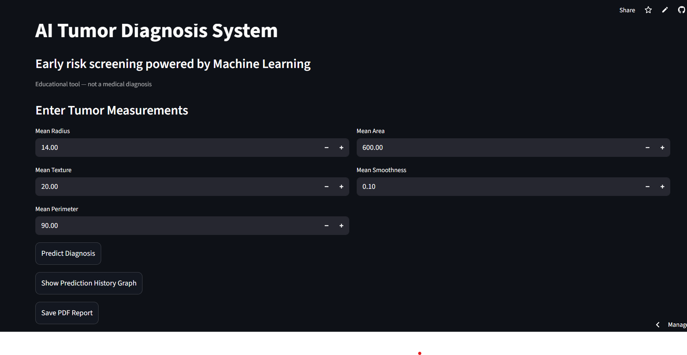

# Breast Cancer Prediction System

## Overview

This project is a machine learning web application that predicts whether a breast tumor is malignant or benign using clinical measurements.

The model is trained on the Breast Cancer Wisconsin dataset and deployed as an interactive Streamlit web app.

This project demonstrates the complete machine learning workflow:

- data loading and preprocessing  
- model training using Logistic Regression  
- model evaluation with accuracy and confusion matrix  
- model serialization using pickle  
- interactive UI using Streamlit  
- cloud deployment  

---

## Live Demo

Access the deployed application here:

https://tumor-ai-app-ukefjyqhjsyqsps7h6mgye.streamlit.app/

---

## App Preview

---

## Problem Statement

Early detection of breast cancer is critical for effective treatment. This project uses machine learning to classify tumors based on medical measurements.

This project is for educational purposes only and not for medical diagnosis.

---

## Dataset

The model is trained using the Breast Cancer Wisconsin dataset available from scikit-learn.

Each sample contains numerical features describing tumor characteristics such as:

- mean radius  
- mean texture  
- mean perimeter  
- mean area  
- mean smoothness  

Target values:

- 0 = malignant  
- 1 = benign  

---

## Tech Stack

- Python  
- NumPy  
- scikit-learn  
- Streamlit  
- Pickle  

---

## Project Structure

project-folder/

- train_model.py      (trains and saves the ML model)  
- app.py              (Streamlit web application)  
- model.pkl           (saved trained model)  
- requirements.txt    (dependencies)  
- README.md  

---

## How to Run Locally

Clone the repository:

git clone YOUR_REPO_LINK  
cd YOUR_REPO_NAME  

Install dependencies:

pip install -r requirements.txt  

Run the Streamlit app:

streamlit run app.py  

---

## Future Improvements

- add full feature alignment with all inputs  
- add model explainability  
- improve UI design  
- add input validation  
- support batch predictions  

---

## Author

Rachel Mathew  
Machine Learning Project